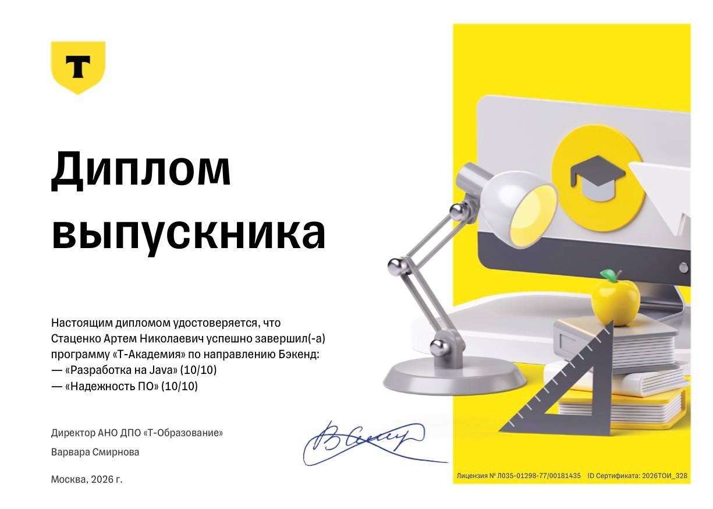

# Академия бэкенда от Т-Банка, 01.09.2024 - 01.01.2026. Срок обучения: 1,5 года

## 1 семестр

### План лекций

**Модуль 1. Парадигмы программирования**

* Лекция 1. Погружение в объектно-ориентированное программирование
* Лекция 2. Функциональное программирование
* Лекция 3. Дата-ориентированное программирование
* Лекция 4. Обработка исключений

**Модуль 2. Принципы и шаблоны проектирования**

* Лекция 5. Принципы дизайна ПО
* Лекция 6. Современные шаблоны проектирования
* Лекция 7. Антипаттерны проектирования
* Лекция 8. Моделирование предметной области

**Модуль 3. Качество и тестирование ПО**

* Лекция 9. Способы тестирования ПО
* Лекция 10. Чистый код

**Модуль 4. Многопоточность и асинхронность**

* Лекция 11. Основы многопоточного программирования
* Лекция 12. Модели многопоточного исполнения
* Лекция 13. Высокоуровневые шаблоны многопоточного программирования

**Модуль 5. Разработка в команде**

* Лекция 14. Современная разработка ПО
* Лекция 15. Работа с требованиями и техническим заданием

### Домашние задания
1. [Виселица](https://github.com/stacenko-developer/hangman-game)
2. [Лабиринты](https://github.com/stacenko-developer/maze)
3. [Анализатор логов](https://github.com/stacenko-developer/log-analyzer)
4. [Фрактальное пламя](https://github.com/stacenko-developer/fractal-flame)
5. [Изменение производительности](https://github.com/stacenko-developer/reflection-benchmark)

## 2 семестр

### План лекций

**Модуль 1. Протоколы и инструменты backend-приложений**

* Лекция 1. HTTP-протокол, HTTP-сервер и обработка
* Лекция 2. Контрактная разработка: OpenAPI, RESTful, HATEOAS, SOAP
* Лекция 3. Прикладные протоколы: gRPC, GraphQL, WebSocket
* Лекция 4. Контейнеризация приложений и зависимостей

**Модуль 2. SQL и СУБД**

* Лекция 5. Реляционные БД и язык SQL
* Лекция 6. Индексы в реляционных СУБД
* Лекция 7. Нереляционные БД

**Модуль 3. Асинхронное общение**

* Лекция 8. Системы очередей на примере Apache Kafka
* Лекция 9. Сервис-ориентированная архитектура и масштабирование приложений
* Лекция 10. Потоковая и пакетная обработка

**Модуль 4. Отказоустойчивость приложений**

* Лекция 11. Что такое надежность
* Лекция 12. Шаблоны обеспечения отказоустойчивости распределенных систем

**Модуль 5. Администрирование и мониторинг приложений**

* Лекция 13. Телеметрия приложения: логгирование, метрики, трейсинг
* Лекция 14. Развертывание приложения: CI и CD
* Лекция 15. Основы Kubernetes

### Домашние задания
1. [LinkTracker: приложение для отслеживания обновлений контента](https://github.com/stacenko-developer/link-tracker)

## 3 семестр

### План лекций

* Лекция 1. Эксплуатация и обеспечение бесперебойной работы нетривиальных информационных систем.
* Лекция 2. Из чего состоит надежность и принципы надежности
* Лекция 3. Распределенные системы
* Лекция 4. Архитектура. Часть 1
* Лекция 5. Архитектура. Часть 2
* Лекция 6. Распределенные транзакции
* Лекция 7. Хранение данных
* Лекция 8. Репликация
* Лекция 9. Партиционирование
* Лекция 10. Задачи мониторинга
* Лекция 11. Логи
* Лекция 12. Детектирование сбоев - прямое и косвенное

### [Домашние задания](https://github.com/stacenko-developer/tbank-backend-academy-sre)